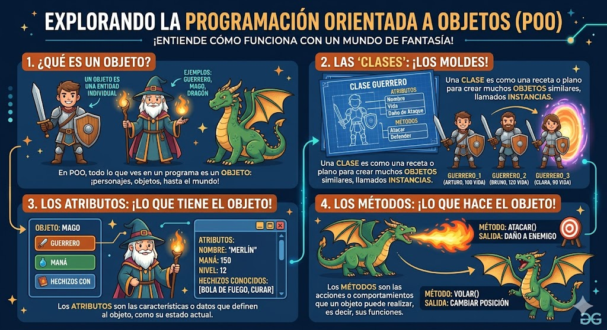

# POO en python
introduccion orientad a objetos (poo) en python

## porque aprender POO

- imagina que quieres crear un videojuego. tienes gerreros magos dragones ...cada uno cn sus propios puntos de vida ataques y avilidades. ¿como losorganizo en codigo sin repetir ninguno otra vez?

- la**programacion orientada a objetos (POO) ** es la respuesta. en lugar de escribir instrucciones aueltas, modelas el mundo real con *objetos* que tiene caracteristicas y comportamientos. es la forma en la que estan construidos la malloria de los programasa profesionales del mundo 



## Clase de ojeto 

- Una clse es un tipo de dato cullas variables se llaman objetos o instancias.

- la clse es la definicin del mundo real y los objetos o instancias son elpropio "objeto" del mundo real

-las clases estan compuestas de 2 elementos :
   - **Atributos** informacion que almasenan la calse 
   - **Metodos** operaciones que pueden realisarsen con la clase 

## Definicon de una clse en python 
```python
class NombreClase:

     def___init__(self, variable1, variable2):
         self.atributo1 = valor 1
         self.atributo2 = valor 2
      
      def nombreMetodo(self):
         Bloquecodigo
```   


- `class` : palabra resservada en python para definir una clase 
- `Nombreclase` : nombre de la clse que se quiere crear 
- `def` : palabra resservada en python que se utilisa  para definir tanto el constructor  de case (metodo que se ejecuta la primera vez que se usa una clse) como los diferentes metodos que tiene.
- `__int__`: palabre reservada en python para definir e metodo constructor de la clase. El metodo `__int__` es l primero que e ejecuta cuendo creas un objeto de una clase .
- `(self, Variablex)`: parametro de constructor de la clase . El parametro `sef` es obligaorio y despues puedes tener los para metros que quieras. La froma para añadir parametros es la misma que para añadir funciones
- `self.AtributoX`: forma de autorisacion y acseso a los atributos de la clase.
- `nombreMetodo`: nombre del metodo de la clase.
- `self`: parametro del metodo. El parametro `self` es oblgatorio y despues es obligatori y despues puedes tener tantos parametros  tantos como quieras.
- `BloqueCodigo`: instrucciones que ejecutaran e metodo.

**Al definir una clase tenga en cuenta:**
- puedes definir tantos atributos como nesesites. 
- puedes definir tantos metodos como nesesites.
- puedes definir tantos parametros en e constructor y en los metodos como nesesites.