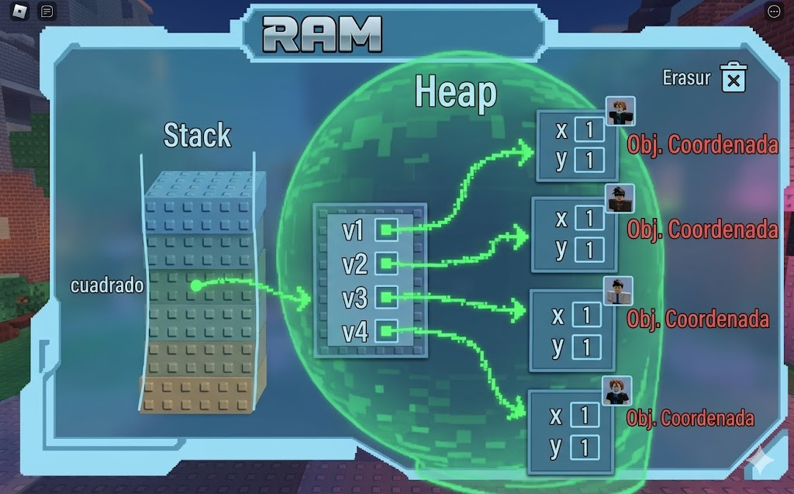

# POO en python
introduccion orientad a objetos (poo) en python

## porque aprender POO

- imagina que quieres crear un videojuego. tienes gerreros magos dragones ...cada uno cn sus propios puntos de vida ataques y avilidades. ¿como losorganizo en codigo sin repetir ninguno otra vez?

- la**programacion orientada a objetos (POO) ** es la respuesta. en lugar de escribir instrucciones aueltas, modelas el mundo real con *objetos* que tiene caracteristicas y comportamientos. es la forma en la que estan construidos la malloria de los programasa profesionales del mundo 


## Clase de ojeto 

- Una clse es un tipo de dato cullas variables se llaman objetos o instancias.

- la clse es la definicin del mundo real y los objetos o instancias son elpropio "objeto" del mundo real

-las clases estan compuestas de 2 elementos :
   - **Atributos** informacion que almasenan la calse 
   - **Metodos** operaciones que pueden realisarsen con la clase 

## Definicon de una clse en python 
```python
class NombreClase:

     def___init__(self, variable1, variable2):
         self.atributo1 = valor 1
         self.atributo2 = valor 2
      
      def nombreMetodo(self):
         Bloquecodigo
```   


- `class` : palabra resservada en python para definir una clase 
- `Nombreclase` : nombre de la clse que se quiere crear 
- `def` : palabra resservada en python que se utilisa  para definir tanto el constructor  de case (metodo que se ejecuta la primera vez que se usa una clse) como los diferentes metodos que tiene.
- `__int__`: palabre reservada en python para definir e metodo constructor de la clase. El metodo `__int__` es l primero que e ejecuta cuendo creas un objeto de una clase .
- `(self, Variablex)`: parametro de constructor de la clase . El parametro `sef` es obligaorio y despues puedes tener los para metros que quieras. La froma para añadir parametros es la misma que para añadir funciones
- `self.AtributoX`: forma de autorisacion y acseso a los atributos de la clase.
- `nombreMetodo`: nombre del metodo de la clase.
- `self`: parametro del metodo. El parametro `self` es oblgatorio y despues es obligatori y despues puedes tener tantos parametros  tantos como quieras.
- `BloqueCodigo`: instrucciones que ejecutaran e metodo.

**Al definir una clase tenga en cuenta:**
- puedes definir tantos atributos como nesesites. 
- puedes definir tantos metodos como nesesites.
- puedes definir tantos parametros en e constructor y en los metodos como nesesites.

## Ejemplo 1

- crear una calse que represente una persona. 
- Atributos: nombre, apellidos y edad.
- Metodos: Nostrar la infirmaion de la persona. 

## Codigo 

```python
class persona:
   
   def__init__(self,nombre, apellidos, edad,):
      self.nombre = nombre
      self.apellidos =apellidos
      self.edad = edad
      
   
   def mostrarpersona(self):
      print("nombre: ", self.nombre)
      print("apellidos: ", self.apellidos)
      print("edad: "; self.edad)

def main():
     print("Vamos a aprender POO...")
     persona_1 = persona("lorenzo", "perez", "18")
     persona_1.mostrarpersona()

if__name__ == main():
   main()
```
## composision 

- consisste a la creasion de nuevas clases a partir de nuevas clases existentes que actuan como elementos compositores de la nueva
- las clases existentes seran atrivutos de nuevas clases

## ejemplo

-una coordenada en 2 dimensiones esta compuesta por 2 valores, el valor en el eje de las x  y el valor en el eje de las y esto podria ser una clase
- un cuadrado esta compuesto por 4 coordenadas que son ls 4 vertises. esto podria ser una clse que esta comuesta por 4 clases delobjeto coordenada 

### codigo python

```python
class coordenada:
   #metodo constructor
   def__inif__(self,x,y):
   self. y = y
   def.mostrarcoordenada()
   print("(",self.x,",",self.y,")")
   class cuadrado
   # metodo constructor 
   def__init__(self,v1,v2,v3,v4)
   self,v1 = v1
   self,v2 = v2 
   self,V3 = v3
   self,v4 = v4

   def mostrarvertises(self):
      print("El cuadrado esta compuesto por los siguientes vertices:")
      self.v1.mostrarcoordenada()
      self.v2.mostrarcoordenada()
      self.v3.mostrarcoordenada()
      self.v4.mostrarcoordenada()

      def main():
         v1 = coordenada(1.1)
         v2 = coordenada(1.4)
         v3 = coordenada(4.4)
         v4 = coordenada(4.1)
```




## Encapsulació

- uno de los objetivos que tiene la poo es protejer los datos de acceso o usos no controados y esto es lo que se comose como **encapsulació**
- los datos(atrivutos) que componen una clase son de dos tipos:
   - **públicos:** los datos son accesibles sin control es decir los datos son usados sin ningun tipo de mecanismos ante usos no autorisados o indebidos
   - **privados:** los datos no pueden ser acsedidos sin control y para acceder a ellos se deveran inplementar un metodo que acceda a ellos. De esta manera los datos unicamente acccedidos a su proia clase
- la encapsulacion tambien puederealisarse sobre los metodos 
- la definición de atrivutos privados se realisan incluyendo los caracteres "__" (dos rallas de piso) entre la palabra **self** y el nombre del atributo.

### ejemplo

### codigo python

```python
class coordenada:
   #metodo constructor
   def__inif__(self,x,y):
   self.__x = x
   self,__Y = Y

#metodos de acceso
def getX(self):
   return self.__X
def setX(self,x):
   self.__X = x
def getY(self):
   return self.__Y
def getY(self,y):
   self.__Y = y

   def mostrarcoordenada(self):
      print("(",self.__X",", self.__Y, ")")


   def.mostrarcoordenada()
   print("(",self.x,",",self.y,")")
   class cuadrado
   # metodo constructor 
   def__init__(self,v1,v2,v3,v4)
   self,v1 = v1
   self,v2 = v2 
   self,V3 = v3
   self,v4 = v4

   def mostrarvertises(self):
      print("El cuadrado esta compuesto por los siguientes vertices:")
      self.v1.mostrarcoordenada()
      self.v2.mostrarcoordenada()
      self.v3.mostrarcoordenada()
      self.v4.mostrarcoordenada()

      def main():
         v1 = coordenada(1.1)
         v2 = coordenada(1.4)
         v3 = coordenada(4.4)
         v4 = coordenada(4.1)


## Herencia
- Permite la reutilización de código.
- Consiste en la definición de una clase utilizando como base una clase ya existente.
- La nueva clase derivada tendrá todas las caracteristicas de la clase base y ampliará el concepto de esta, es decir, tendrá todos los atributos y métodos de la clase base.
- Significa que entre dos clases existe una relación del tipo "es un".
- La herencia en Python se especifica de la siguiente manera: ```class NombreClase(ClaseBase):```
- Ejemplo:
    - Pensemos en una persona como una clase, la persona tendría una serie de atributos como pueden ser el nombre, los apellidos, la edad, etc.  Esas características de una persona serían compartidas por todas aquellas clases hijas como pueden ser alumno y profesor.  Es decir, alumno y profesor heredarían las propiedades de la clase persona y tendrían sus propias propiedades, diferentes entre ellas, como por ejemplo el curso en el que está el alumno y el horario de tutorias del profesor.

    - Clase base: Persona
        - Atributos:
            - Nombre
            - Apellidos
            - Edad

    - Clase derivada: Alumno
        - Atributos:
            - Curso
            - Asignaturas
    
    - Clase derivada: Profesor
        - Atributos:
            - Antigüedad
            - Tutorias
            - Teléfono